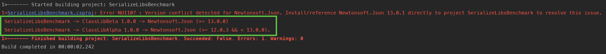

# Demo Different kinds of Json Serialization benchmarks

This repository contains a set of benchmarks to compare three kinds of C# Class object to JSON string serialization: [Newtonsoft Json.NET](https://www.newtonsoft.com/json) v12 & v13, and [built-in performant version of System.Text.Json since .NET 8](https://devblogs.microsoft.com/dotnet/performance-improvements-in-net-8/#jsonhttps://devblogs.microsoft.com/dotnet/performance-improvements-in-net-8/#json).

You need to install .NET 8 & .NET 9 SDKs, and PowerShell v7+ to run the benchmarks.

And optionally you can [install Microsoft Crank Controller and Agent global tool packages](https://github.com/dotnet/crank/blob/main/docs/getting_started.md) and setup remote Crank Agent machine to run benchmarks on [Microsoft Crank](https://youtu.be/2IgfrnG-128?si=4jTk4TQnu8q5ciO9&t=236).

## JsonNetWithNugetBenchmark

The ***JsonNetWithNugetBenchmark*** folder contains a benchmark project that compares the performance of using `JsonConvert.SerializeObject()` API of Newtonsoft.Json v12.x and v13.x by BenchmarkDotNet's `WithNuget()`.

To run the benchmark, navigate to the ***JsonNetWithNugetBenchmark*** folder and run the following command:

```
dotnet run --configuration Release -- --filter 'JsonNetWithNugetBenchmark.JsonNetSerializerBenchmark.ToJsonString'
```

Or use the handy PowerShell script `run_JsonNetCompare.ps1` inside the ***JsonNetWithNugetBenchmark*** folder.

The **demo.benchmarks.yml** file is a configuration file for the Crank Controller to run the benchmark on the Crank Agent machine (for example on the IP address 192.168.159.133), run crank controller command as:

```
 crank --config ./demo.benchmarks.yml --scenario demo_benchmark --profile remote --variable remote_host=192.168.159.133
```


## ClassLibAlphaBenchmark, ClassLibBetaBenchmark, ClassLibGammaBenchmark

These three folders contain benchmark projects that shows the performance of using different JSON Serialization API.

* ClassLibAlphaBenchmark: project reference to the Class library **ClassLibAlpha** in  ***libs\ClassLibAlpha*** folder that is a wrapper of the `JsonConvert.SerializeObject()` API in Newtonsoft.Json v12.x.
* ClassLibBetaBenchmark: project reference to the Class library **ClassLibBeta** in  ***libs\ClassLibBeta*** folder that is a wrapper of the new `JsonConvert.SerializeObject()` overloaded version of API in Newtonsoft.Json v13.x.
* ClassLibGammaBenchmark: project reference to the Class library **ClassLibGamma** in  ***libs\ClassLibGamma*** folder that is a wrapper of `JsonSerializer.Serialize()` API in System.Text.Json

To run those benchmarks, navigate to the ***ClassLibAlphaBenchmark***, ***ClassLibBetaBenchmark***, or ***ClassLibGammaBenchmark*** folder and run the `run_toJson.ps1` PowerShell script inside each folder.

The **classlibs.benchmarks.yml** file is a configuration file for the Crank Controller to run those three benchmark projects with .NET 8 & .NET 9 on the Crank Agent machine (for example on the IP address 192.168.159.133), 

.NET 9 benchmarks:

```
crank --config ./classlibs.benchmarks.yml --scenario classlib-alpha-net9-benchmark --profile remote --variable remote_host=192.168.159.133
crank --config ./classlibs.benchmarks.yml --scenario classlib-beta-net9-benchmark --profile remote --variable remote_host=192.168.159.133
crank --config ./classlibs.benchmarks.yml --scenario classlib-gamma-net9-benchmark --profile remote --variable remote_host=192.168.159.133
```


The similar command can be used for .NET 8 benchmarks.

```
crank --config ./classlibs.benchmarks.yml --scenario classlib-alpha-net8-benchmark --profile remote --variable remote_host=192.168.159.133
crank --config ./classlibs.benchmarks.yml --scenario classlib-beta-net8-benchmark --profile remote --variable remote_host=192.168.159.133
crank --config ./classlibs.benchmarks.yml --scenario classlib-gamma-net8-benchmark --profile remote --variable remote_host=192.168.159.133
```

You can add additional `--json` option of the Crank Controller to [save each benchmark results in JSON format files](https://github.com/dotnet/crank/blob/main/docs/storing_results.md#local-json-files), than use the `compare` command option to combine those results.

## SerializeLibsBenchmark

The ***SerializeLibsBenchmark*** folder contains a benchmark project that compares the performance of above mentioned **ClassLibAlpha**, **ClassLibBeta**, **ClassLibGamma** that use different version of `JsonConvert.SerializeObject()` API of Newtonsoft.Json v12.x, v13.x, and `JsonSerializer.Serialize()` API of System.Text.Json all at once via some techniques of *MSBuild Copy task* at build time and *Custom Assembly Resolver* at runtime to resolve version conflict of JSON.NET nuget package:



To run the benchmark locally, navigate to the ***SerializeLibsBenchmark*** folder and run the `run_toJson.ps1` PowerShell script.

The **serializeLibs.benchmarks.yml** file is a configuration file for the Crank Controller to run the benchmark on the Crank Agent machine (for example on the IP address 192.168.159.133), run crank controller command as:

```
crank --config ./serializeLibs.benchmarks.yml --scenario benchmark --profile remote --variable remote_host=192.168.159.133
```

